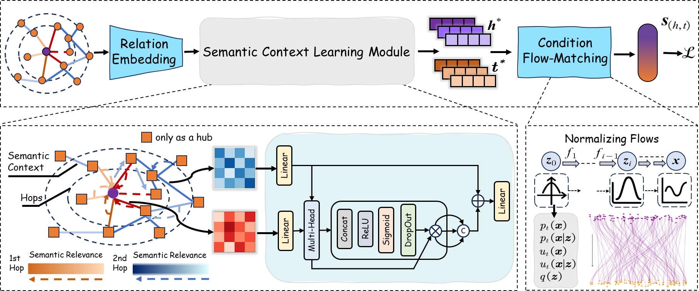

# Flow-Modulated Scoring for Semantic-Aware Knowledge Graph Completion

[](https://opensource.org/licenses/MIT)[](https://www.python.org/downloads/release/python-380/)[](https://pytorch.org/)

This is the official PyTorch implementation of the paper **"Flow-Modulated Scoring for Semantic-Aware Knowledge Graph Completion"**.

Our work introduces the **Flow-Modulated Scoring (FMS)** framework, a novel paradigm for knowledge graph completion that unifies context-aware static representations with a dynamic evolutionary modeling of relations.



## Performance Highlights

-   🚀 **State-of-the-art performance** on multiple standard benchmarks for both **relation prediction** and **entity prediction**.
-   🏆 **Relation Prediction**: Achieves near-perfect scores with **99.8% MRR** on FB15k-237 and **99.9% MRR** on WN18RR.
-   🏆 **Entity Prediction**: Delivers a massive **25.2% relative MRR gain** on FB15k-237 and a near-perfect **99.3% MRR** on Kinship.
-   💡 **Highly Parameter-Efficient**: Attains top results on FB15k-237 using only **0.35M parameters**, outperforming models with millions more.
-   💪 **Superior Inductive Learning**: Substantially outperforms all baselines in challenging inductive settings for both tasks, demonstrating powerful generalization capabilities.

---

## Installation

1. Clone the repository:
    ```bash
    git clone https://github.com/yuanwuyuan9/FMS.git
    cd FMS
    ```

2. Install the required dependencies using pip:
    ```bash
    pip install -r requirements.txt
    ```

---

## Running Relation Prediction Experiments

First, go to the `Relation Prediction folder`

```bash
cd Relation_Prediction
```

Second, All hyperparameters and experiment configurations are centralized in the `run.py` file.

To run an experiment, simply modify the parameters as needed within `run.py` and execute the script from your terminal:
```bash
python run.py
```

---

## Running Entity Prediction Experiments

First, go to the `Entity Prediction folder`

```bash
cd Entity_Prediction
```

Second, All hyperparameters and experiment configurations are centralized in the `run.py` file.

To run an experiment, simply modify the parameters as needed within `run.py` and execute the script from your terminal:

```bash
python run.py
```

------

## Main Results

FMS establishes a new state of the art on both major KGC tasks. Below are summary tables of our key results. For a full comparison, please see the paper.

### Transductive Setting

#### Relation Prediction
| Model          | FB15k-237 (MRR) | WN18RR (MRR) | NELL995 (MRR) | DDB14 (MRR) |
| :------------- | :-------------: | :----------: | :-----------: | :---------: |
| RotatE         |      97.0       |     79.9     |     72.9      |    95.3     |
| PathCon        |     _97.9_      |     97.4     |     89.6      |   _98.0_    |
| KG-BERT        |      97.3       |     94.2     |       -       |      -      |
| CBLiP          |      97.1       |    _97.6_    |    _91.9_     |      -      |
| **FMS (Ours)** |   **`99.8`**    |  **`99.9`**  |  **`99.1`**   | **`99.8`**  |

#### Entity Prediction
| Model          | FB15k-237 (MRR) | NELL995 (MRR) | Kinship (MRR) | UMLS (MRR) |
| :------------- | :-------------: | :-----------: | :-----------: | :--------: |
| RotatE         |      33.7       |     35.6      |     65.1      |    74.4    |
| PathCon        |      50.6       |     49.5      |     78.8      |    90.1    |
| AdaProp        |      42.5       |    _55.2_     |     83.6      |   _96.4_   |
| FDM            |      48.5       |       -       |    _83.7_     |    92.2    |
| KGDM           |     _52.0_      |       -       |     78.9      |    90.9    |
| DiffusionE     |      37.6       |     52.2      |       -       | **`97.0`** |
| **FMS (Ours)** |   **`67.2`**    |  **`60.6`**   |  **`99.3`**   |    92.5    |

### Inductive Setting

#### Relation Prediction (Representative results on v4 splits)
| Model          | WN18RR v4 (H@10) | FB15k-237 v4 (H@10) | NELL-995 v4 (H@10) |
| :------------- | :--------------: | :-----------------: | :----------------: |
| GraIL          |       73.4       |        89.3         |        73.2        |
| PathCon        |      _98.7_      |       _96.0_        |       _95.6_       |
| **FMS (Ours)** |    **`99.5`**    |     **`99.9`**      |     **`99.8`**     |

#### Entity Prediction (Representative results on v4 splits)
| Model          | FB15k-237 v4 (MRR) | NELL-995 v4 (MRR) |
| :------------- | :----------------: | :---------------: |
| RED-GNN        |        44.2        |       36.3        |
| AdaProp        |       _45.4_       |      _36.6_       |
| DiffusionE     |        44.6        |       30.8        |
| **FMS (Ours)** |     **`57.6`**     |    **`39.1`**     |

